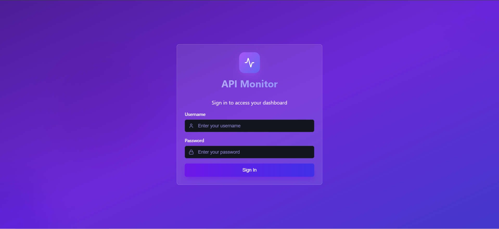
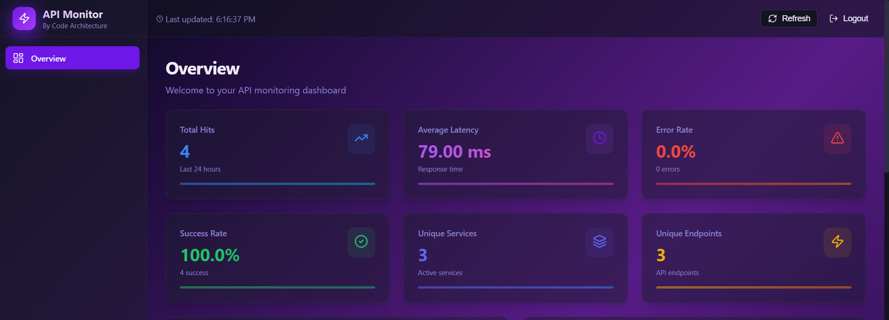
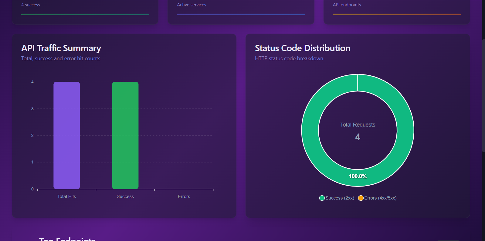
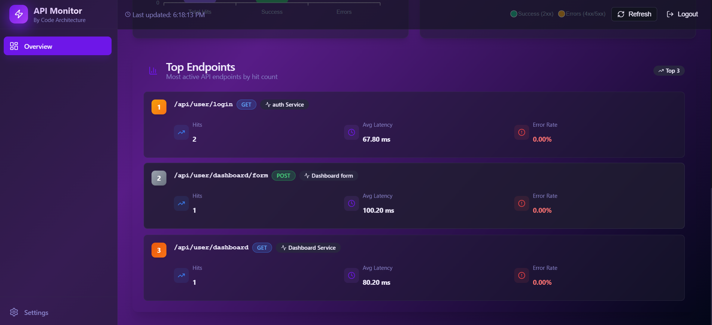
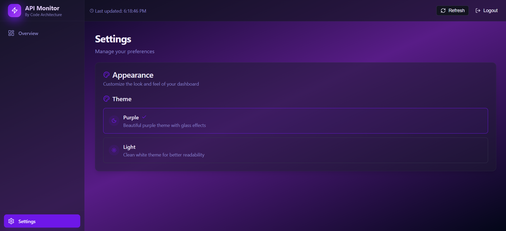

# 🚀 API Monitor Dashboard

A production-inspired **API Monitoring & Analytics Platform** built using **React, Node.js, Express.js, PostgreSQL, MongoDB, RabbitMQ, Docker, and TypeScript**.

It collects API request metrics asynchronously, processes them through RabbitMQ, stores analytics in PostgreSQL, and provides a modern dashboard for monitoring API performance in real time.

---

# 🌐 Live Demo

### Frontend

[https://your-dashboard-url.vercel.app](http://16.171.59.13:4173/)

---

# 🔑 Demo Login

| Username   |   Password   |
|------------|--------------|
| Himanshu   | Password@121 |

> **Note:** The backend is hosted on an AWS EC2 Free Tier instance. The first request may take a few seconds if the server has just started.

---

# 🏗 System Architecture

```
                     React Dashboard
                            │
                            │ REST API
                            ▼
                     Express.js Server
                            │
          ┌─────────────────┼─────────────────┐
          │                 │                 │
          ▼                 ▼                 ▼
      Authentication    Client APIs     Ingest Service
          │                                │
          ▼                                ▼
      MongoDB                     RabbitMQ Queue
                                           │
                                           ▼
                                   Background Consumer
                                           │
                                           ▼
                                   PostgreSQL Metrics
                                           │
                                           ▼
                                   Analytics Service
                                           │
                                           ▼
                                   Dashboard Charts
```

---

# 📂 Backend Architecture

The backend follows a **Modular Monolith Architecture**, where every business module is isolated while sharing common infrastructure.

```
server/
│
├── src/
│
├── services/
│   │
│   ├── auth/
│   │   ├── controller/
│   │   ├── service/
│   │   ├── repository/
│   │   ├── routes/
│   │   ├── validation/
│   │   └── dependencies/
│   │
│   ├── client/
│   │   ├── controller/
│   │   ├── service/
│   │   ├── repository/
│   │   ├── routes/
│   │   └── dependencies/
│   │
│   ├── ingest/
│   │   ├── controller/
│   │   ├── service/
│   │   ├── routes/
│   │   └── dependencies/
│   │
│   ├── analytics/
│   │   ├── controller/
│   │   ├── service/
│   │   ├── routes/
│   │   └── dependencies/
│   │
│   └── processor/
│       ├── repository/
│       ├── service/
│       ├── consumer.js
│       └── dependencies/
│
├── shared/
│   ├── config/
│   ├── middleware/
│   ├── constants/
│   └── events/
│
├── models/
├── utils/
├── consumer.js
└── server.js
```

---

# 🏛 Design Patterns

- Modular Monolith
- Layered Architecture
- Repository Pattern
- Dependency Injection
- Service Layer Pattern
- Event-Driven Architecture
- Background Worker Pattern

---

# 🔄 Request Flow

```
Client

   │

   ▼

Express Route

   │

   ▼

Controller

   │

   ▼

Service Layer

   │

   ▼

Repository Layer

   │

   ├──────────────► MongoDB

   │

   ▼

RabbitMQ Queue

   │

   ▼

Consumer Worker

   │

   ▼

PostgreSQL

   │

   ▼

Analytics APIs

   │

   ▼

React Dashboard
```

---

# ⚡ Features

## Authentication

- JWT Authentication
- Secure Login
- Protected Routes
- Role Based Access Control
- Logout

---

## API Monitoring

- Total API Hits
- Average Response Time
- Success Rate
- Error Rate
- Active Services
- Active Endpoints

---

## Analytics Dashboard

- API Traffic Summary
- Status Code Distribution
- Top Endpoints
- Average Latency
- Error Analytics
- Real-Time Metrics

---

## Backend

- REST APIs
- Repository Pattern
- Dependency Injection
- Validation Middleware
- Centralized Error Handling
- Structured Logging
- Rate Limiting

---

## Async Processing

- RabbitMQ Message Queue
- Background Consumer
- Reliable Event Processing
- Scalable Architecture

---

## UI

- Responsive Dashboard
- Purple Glassmorphism Theme
- Light Theme
- Interactive Charts
- Refresh Dashboard
- Beautiful Login Screen

---

# 🛠 Tech Stack

## Frontend

- React
- TypeScript
- Vite
- React Router
- React Query
- Axios
- ApexCharts
- Lucide Icons

---

## Backend

- Node.js
- Express.js
- TypeScript

---

## Databases

- MongoDB Atlas
- PostgreSQL (Supabase)

---

## Messaging

- RabbitMQ (CloudAMQP)

---

## DevOps

- Docker
- Docker Compose
- AWS EC2
- Vercel

---

# 🧠 Why RabbitMQ?

Instead of inserting every API request directly into PostgreSQL, requests are first published to RabbitMQ.

A dedicated background consumer processes the queue and stores analytics asynchronously.

### Benefits

- Faster API responses
- Decoupled services
- Better scalability
- Fault tolerance
- High throughput

---

# 📸 Screenshots

## Login



---

## Dashboard Overview



---

## Analytics Dashboard



---

## Top Endpoints



---

## Theme Settings



---

# 🚀 Deployment

| Service | Hosting |
|----------|----------|
| Frontend | Vercel |
| Backend | AWS EC2 (Docker) |
| PostgreSQL | Supabase |
| MongoDB | MongoDB Atlas |
| RabbitMQ | CloudAMQP |

---

# 🚀 Running Locally

## Clone Repository

```bash
git clone https://github.com/Singh0Himanshu/api-monitor.git
```

```bash
cd api-monitor
```

### Backend

```bash
cd server
npm install
npm run dev
```

### Frontend

```bash
cd client
npm install
npm run dev
```

### Docker

```bash
docker compose up --build
```

---

# 🔮 Future Improvements

- Live WebSocket Monitoring
- API Health Checks
- Email Alerts
- Slack Notifications
- Kubernetes Deployment
- Redis Caching
- Multi-Tenant Support

---

# 👨‍💻 Author

**Himanshu Singh**

### Portfolio

[https://my-portfolio.vercel.app](https://portfolio-drab-five-ziiwjrl4vd.vercel.app/)

### GitHub

https://github.com/Singh0Himanshu

### LinkedIn

[https://linkedin.com/in/my-linkedin](https://www.linkedin.com/in/himanshu-singh-h/)
